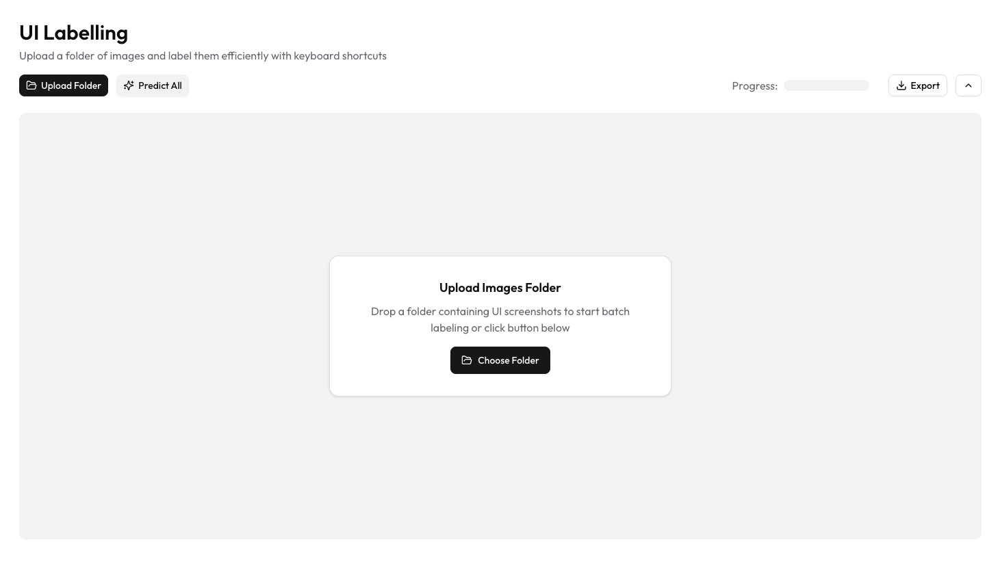
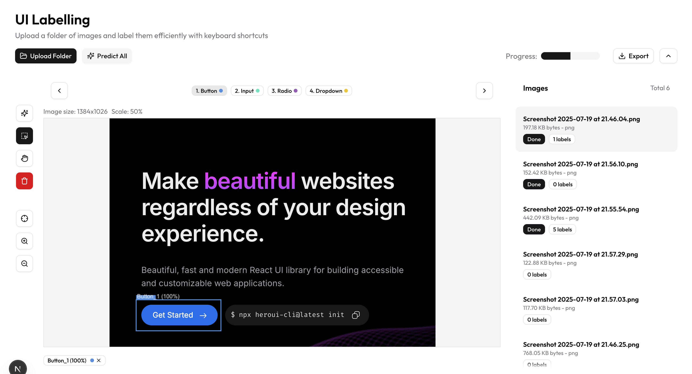

## UI Labelling App

## [Try Online](https://ui-component-labeling-app.vercel.app/)




## Stack
- [NextJS 15](https://nextjs.org/)
- [tailwindcss](https://tailwindcss.com/)
- [Shadcn UI](https://ui.shadcn.com/)
- [Bun](https://bun.com/)

## Quick start

**Clone Repo**, (remember to add .env file)
```
git clone git@github.com:tonible14012002/ui-component-labeling-app.git
cd ui-component-labeling-app
bun install
bun run dev
```

## Development

```
bun install
bun run dev
```

## Commands

```bash
bun run  dev            # start development server
bun run build           # build production bundle to 'dist' directly
bun run lint            # Run eslint check
```

## Evaluation

Following the instruction of this repo:
[https://github.com/tonible14012002/ui-labelling-evaluation](https://github.com/tonible14012002/ui-labelling-evaluation)